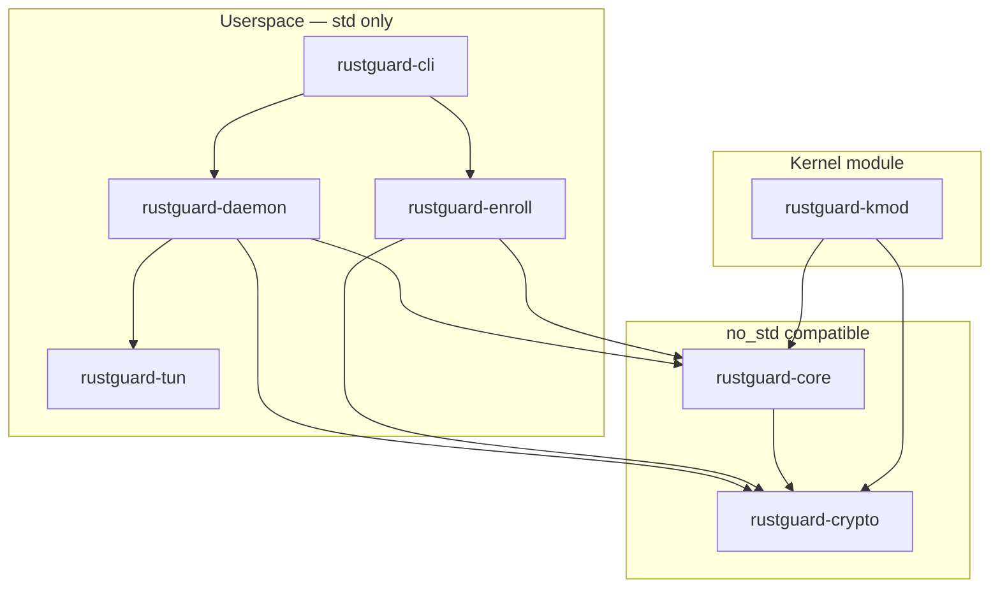

# System Overview

> High-level diagram and component responsibilities for RustGuard's seven-crate architecture spanning userspace and kernel execution environments.

## Overview

RustGuard is a clean-room WireGuard implementation in Rust comprising approximately 8,500 lines across seven crates. It targets two distinct execution environments: a userspace daemon that manages TUN devices and routes encrypted traffic over UDP, and an out-of-tree Linux kernel module that eliminates the TUN context-switch overhead entirely. Both environments share the same cryptographic primitive and protocol implementation crates.

The crate structure enforces strict layering: cryptographic primitives sit at the foundation, the Noise protocol implementation consumes them, OS-level I/O abstraction sits alongside the protocol layer, and daemon, enrollment, and CLI crates compose the upper tiers.

## Crate Inventory

| Crate | Responsibility | `no_std` |
|---|---|:---:|
| `rustguard-crypto` | X25519, ChaCha20-Poly1305, XChaCha20-Poly1305, HMAC-BLAKE2s, HKDF, TAI64N | ✓ |
| `rustguard-core` | Noise_IKpsk2 handshake, transport sessions, replay window, timer state machine | ✓ |
| `rustguard-tun` | macOS utun, Linux TUN, multi-queue TUN, AF_XDP, io_uring, BPF loader | — |
| `rustguard-daemon` | Standard `wg.conf` tunnel mode — `rustguard up` | — |
| `rustguard-enroll` | Zero-config enrollment, CIDR IP pool, Zigbee-style pairing window, persistence | — |
| `rustguard-cli` | CLI dispatcher: `up`, `serve`, `join`, `open`, `close`, `status`, `genkey`, `pubkey` | — |
| `rustguard-kmod` | Linux kernel module (Rust + C shim), out-of-tree, targets kernel 6.10+ | — |

`rustguard-crypto` and `rustguard-core` compile in both `std` and `no_std` modes. The `std` feature flag re-enables convenience trait implementations (e.g., `std::error::Error`) for userspace builds, but the hot-path code — encryption, decryption, handshake, replay window — is allocation-free in both modes. See [Design Decisions](04-Design-Decisions.md) for the rationale behind this boundary.

## Crate Dependency Graph

Arrows point from dependent to dependency.



## Execution Environments

### Userspace Daemon

The userspace path runs as a regular Linux or macOS process. `rustguard-tun` opens a TUN device (`/dev/net/tun` with `IFF_TUN | IFF_NO_PI` on Linux; a `utun` kernel control socket on macOS) and exchanges IP packets with the kernel network stack. All encryption and decryption execute in userspace via `rustguard-crypto`.

Two higher-throughput I/O backends are available beyond the standard TUN path:

- **AF_XDP** — kernel-bypass, zero-copy packet I/O on Linux
- **io_uring** — asynchronous, batched packet I/O on Linux

`rustguard-cli` dispatches to `rustguard-daemon` for `rustguard up` (standard `wg.conf` mode) or to `rustguard-enroll` for `rustguard serve` / `rustguard join` (zero-config enrollment mode).

### Linux Kernel Module

`rustguard-kmod` is an out-of-tree kernel module targeting Linux 6.10+. It is written in Rust with a C shim that bridges to kernel netlink and netdevice APIs. Operating in the kernel eliminates the per-packet context switch imposed by the userspace TUN path.

The kernel module links `rustguard-core` and `rustguard-crypto` compiled in `no_std` mode — the same source as userspace, with no protocol logic duplicated.

## Component Responsibilities

### `rustguard-crypto`

The foundational primitive layer. Implements all cryptographic operations referenced in the WireGuard specification with no external cryptographic library dependencies. For full definitions of each primitive, see [Core Concepts](02-Core-Concepts.md).

Notable implementation details:
- `encrypt()` returns `Option` on nonce exhaustion (2⁶⁰ messages) rather than panicking.
- HMAC-BLAKE2s uses the RFC 2104 ipad/opad double-hash construction — keyed BLAKE2s alone produces non-interoperable output.
- `constant_time_eq` uses `black_box` to prevent LLVM from optimizing out the comparison.

### `rustguard-core`

The protocol layer. Consumes `rustguard-crypto` and implements:

- **Noise_IKpsk2 handshake** — three-message exchange (initiation type 1, response type 2, cookie reply type 3)
- **Transport session management** — per-peer send/receive key material and 64-bit nonce counters
- **2048-bit sliding replay window** — split `check()` / `update()` API; window advances only after successful AEAD decryption
- **Timer state machine** — rekey after 120 s or 2⁶⁰ messages, keepalive, handshake retry with jitter, session expiry
- **AllowedIPs table** — IP-to-session routing for outbound lookup and inbound source verification
- **DoS protection** — MAC1 verified before any DH operation; `CookieChecker` (server) and `CookieState` (client) for the MAC2 cookie mechanism

Handshake state (`chaining key`, `hash`, PSK) is zeroed on drop via `ZeroizeOnDrop`. Sender indices are generated by a CSPRNG (`getrandom` crate).

### `rustguard-tun`

OS abstraction for TUN device I/O. All file descriptors are opened with `O_CLOEXEC`. Provides Linux TUN, macOS utun, multi-queue TUN, AF_XDP, io_uring, and BPF loader interfaces. The data path through this crate is detailed in [Data Flow](03-Data-Flow.md).

### `rustguard-daemon`

Implements `rustguard up <config>`. Parses standard WireGuard `wg.conf` files, instantiates `rustguard-core` sessions from the peer configuration, opens the TUN interface via `rustguard-tun`, and drives the tunnel loop. Handles `SIGINT`/`SIGTERM` for clean shutdown with route cleanup.

### `rustguard-enroll`

Implements zero-config peer provisioning as an alternative to manual `wg.conf` exchange:

- Token-derived XChaCha20 key encrypts the enrollment exchange
- CIDR IP pool allocator — server takes `.1`; clients receive sequential IPs
- UNIX domain control socket for runtime window management
- Atomic timestamp tracks enrollment open/close state; window auto-closes on expiry
- Peer state (keys, assigned IPs) persisted to `~/.rustguard/state.json`

### `rustguard-cli`

Top-level command dispatcher. Subcommands:

| Subcommand | Delegates To | Description |
|---|---|---|
| `up <config>` | `rustguard-daemon` | Start tunnel from a `wg.conf` file |
| `serve` | `rustguard-enroll` | Start enrollment server with IP pool |
| `join <addr>` | `rustguard-enroll` | Enroll as a new client peer |
| `open <seconds>` | `rustguard-enroll` | Open enrollment window for N seconds |
| `close` | `rustguard-enroll` | Close enrollment window immediately |
| `status` | `rustguard-enroll` | Show window state and connected peer count |
| `genkey` | `rustguard-crypto` | Generate a new X25519 private key |
| `pubkey` | `rustguard-crypto` | Derive the public key from a private key on stdin |

### `rustguard-kmod`

Out-of-tree Linux kernel module targeting kernel 6.10+. A C shim bridges Rust code to kernel netlink, netdevice, and socket buffer APIs. Links `rustguard-core` and `rustguard-crypto` in `no_std` mode. The kernel module does not use `rustguard-tun`, `rustguard-daemon`, `rustguard-enroll`, or `rustguard-cli` — it implements its own packet ingress/egress path within the kernel.

## Examples

### Standard tunnel from a configuration file

```bash
rustguard up /etc/wireguard/wg0.conf
```

### Zero-config enrollment — server side

```bash
rustguard serve --pool 10.150.0.0/24 --token mysecret
```

### Zero-config enrollment — client side

```bash
rustguard join 192.168.1.100:51820 --token mysecret
```

### Managing the enrollment pairing window

```bash
# Open for 60 seconds (physical-presence model)
rustguard open 60

# Close immediately
rustguard close

# Inspect current window state and peer count
rustguard status
```

### Key generation

```bash
# Generate a new X25519 private key
rustguard genkey

# Derive the corresponding public key
rustguard genkey | rustguard pubkey
```

## See Also

- [Core Concepts](02-Core-Concepts.md) — Definitions of every cryptographic primitive, handshake message type, and protocol term referenced on this page
- [Data Flow](03-Data-Flow.md) — Per-packet trace through the crate pipeline for the tunnel loop, handshake flow, and enrollment flow
- [Design Decisions](04-Design-Decisions.md) — ADRs explaining the clean-room approach, `no_std` boundary, Noise_IKpsk2 variant, and security fixes
- [Source Tree](../05-Development/01-Source-Tree.md) — Annotated source tree with file-level module descriptions
- [Build and Test](../05-Development/02-Build-and-Test.md) — Build instructions for each crate including the kernel module