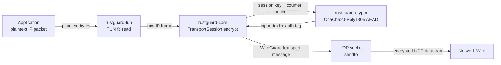
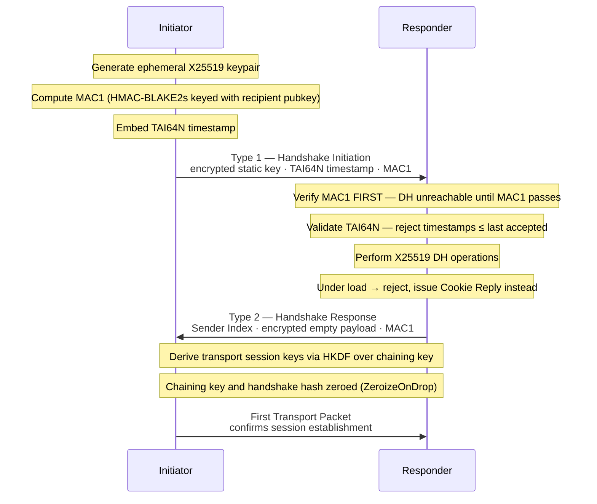
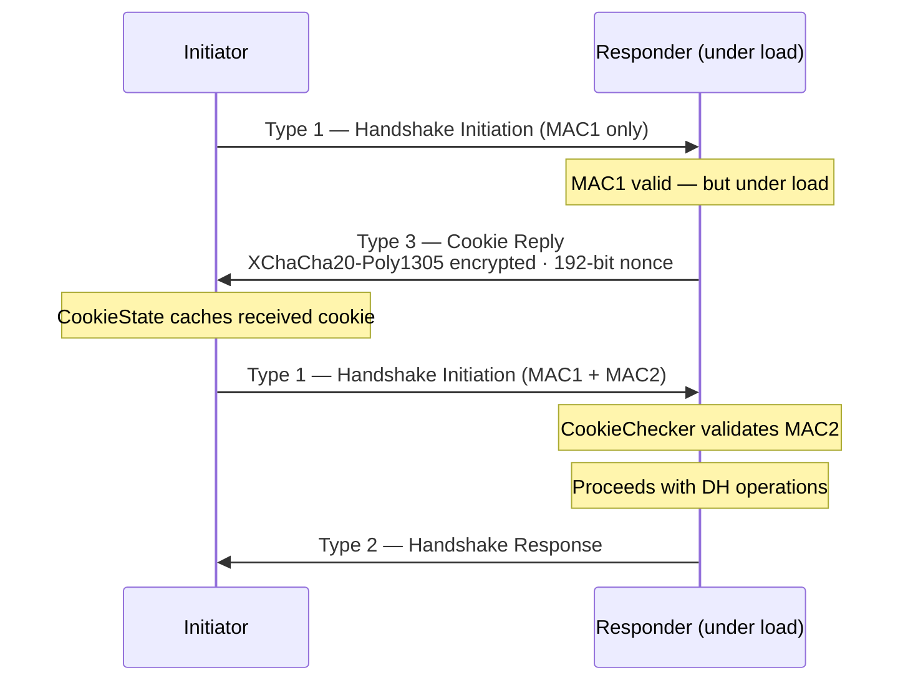
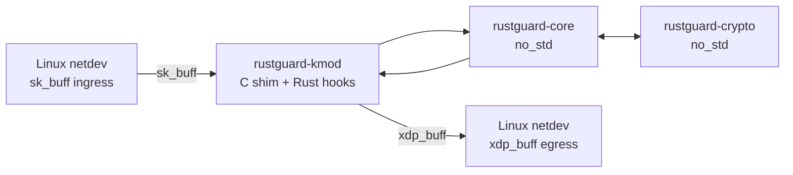
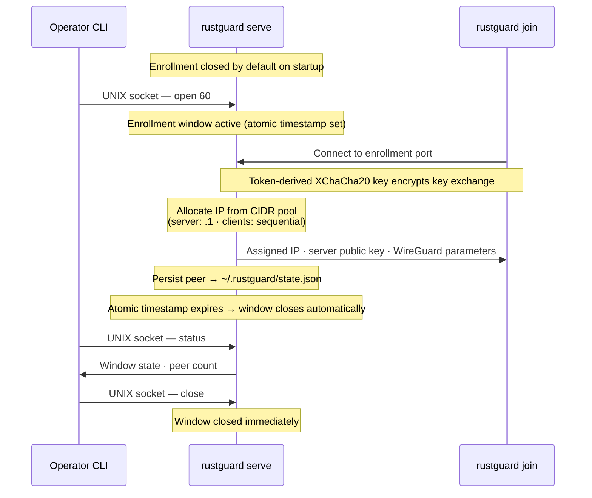

# Data Flow

> End-to-end trace of how packets, handshake messages, and enrollment control signals move through RustGuard's crate pipeline.

## Overview

This page documents the runtime data flows across three operational paths: **transport packet processing** (encrypt and decrypt), **the Noise_IKpsk2 handshake**, and **zero-config enrollment**. Each path is traced at the crate boundary level, showing which module performs each transformation and in what order. For static crate dependencies and deployment mode descriptions, see [System Overview](01-System-Overview.md). For definitions of the protocol concepts referenced below — ChaCha20-Poly1305, replay window, TAI64N, CookieChecker — see [Core Concepts](02-Core-Concepts.md).

---

## Transport Packet Flow — Userspace

In userspace mode, `rustguard-tun` owns the TUN file descriptor and the UDP socket. Plaintext packets enter from the OS network stack via the TUN device; encrypted packets leave via UDP and vice versa.

### Encrypt Path (Outbound)



Processing steps:

1. `rustguard-tun` reads a plaintext IP packet from the TUN file descriptor.
2. `rustguard-core` selects the active `TransportSession` for the destination peer and increments the session counter.
3. Counter exhaustion at 2⁶⁰ messages causes `encrypt()` to return `None`; the caller initiates a rekey rather than the function panicking.
4. `rustguard-crypto` applies ChaCha20-Poly1305 AEAD encryption using the counter as the nonce.
5. The WireGuard transport message is written to the UDP socket.

### Decrypt Path (Inbound)

```mermaid
flowchart LR
    WIRE["Network Wire"]
    UDP_RX["UDP socket\nrecvfrom"]
    CORE_D["rustguard-core\nTransportSession decrypt"]
    CHK["Replay Window\ncheck — before AEAD"]
    CRYPTO_D["rustguard-crypto\nChaCha20-Poly1305 AEAD"]
    UPD["Replay Window\nupdate — after AEAD"]
    TUN_W["rustguard-tun\nTUN fd write"]
    APP["Application\nplaintext IP packet"]

    WIRE -->|encrypted UDP datagram| UDP_RX
    UDP_RX -->|WireGuard transport message| CORE_D
    CORE_D -->|counter| CHK
    CHK -->|pass| CRYPTO_D
    CRYPTO_D -->|verified plaintext| UPD
    UPD -->|plaintext IP frame| TUN_W
    TUN_W -->|plaintext bytes| APP
```



The replay window operates in two explicit phases to prevent window poisoning: `check()` validates the counter before any decryption attempt; `update()` advances the bitmap only after AEAD verification succeeds. A replayed counter or invalid authentication tag causes the packet to be silently dropped without modifying window state.

---

## Handshake Flow

The Noise_IKpsk2 handshake must complete before any transport packets flow. All three message types are exchanged over the same UDP socket as transport traffic.



Ordering constraints enforced by `rustguard-core`:

- MAC1 is the **first** operation on any received handshake message — X25519 DH is unreachable for unauthenticated packets.
- The TAI64N timestamp is compared against the last accepted value; stale initiations are rejected to prevent session hijack via captured packets.
- Sender Index values are assigned by CSPRNG (`getrandom`) rather than a clock-derived counter.

### Session Lifecycle

After the handshake, `rustguard-core`'s timer state machine governs session progression:

| Event | Action |
|---|---|
| 120 s since last handshake | Initiate rekey |
| 2⁶⁰ messages sent | Initiate rekey (nonce exhaustion guard) |
| No traffic within keepalive interval | Send keepalive packet |
| Handshake retry timeout | Retry with random jitter |
| Session expiry without rekey | Tear down session |

---

## DoS Protection Flow

When `rustguard-core` detects the responder is under load, MAC2 becomes required on incoming Handshake Initiation messages before any DH work proceeds.



`CookieChecker` (server) rotates its secret on a timer to bound cookie validity windows. `CookieState` (client) caches the cookie and attaches MAC2 to subsequent initiations until expiry. Cookie payloads use XChaCha20-Poly1305 with a 192-bit nonce to eliminate nonce-reuse risk that would be present in the base ChaCha20-Poly1305 construction.

---

## Kernel Module Data Flow

`rustguard-kmod` removes the TUN file descriptor from the data path entirely, replacing it with direct `sk_buff` and `xdp_buff` access inside the Linux network stack.



`rustguard-crypto` and `rustguard-core` are compiled as `no_std` crates without modification for the kernel build target. The C shim handles the ABI boundary between the Rust crates and the kernel's C-language netdev interface. This path eliminates the kernel–userspace context switch present in all TUN-backed modes.

---

## Enrollment Control Flow

`rustguard-enroll` runs a control plane above `rustguard-core`. Enrollment uses a separate channel from WireGuard transport and must complete before a WireGuard session exists between the peers.



The UNIX domain socket is the exclusive channel for runtime enrollment management. The enrollment window closing does not affect transport sessions already established — existing peers continue operating normally. State written to `~/.rustguard/state.json` is reloaded on daemon restart, so peers do not need to re-enroll.

---

## Examples

### Full Enrollment Session

The following demonstrates the complete enrollment data flow from server startup through client join:

```bash
# Terminal 1 — start enrollment server with a /24 IP pool
rustguard serve --pool 10.150.0.0/24 --token homelab

# Terminal 2 — open a 60-second enrollment window (physical presence model)
rustguard open 60

# Terminal 3 — client joins during the window
# Token-derived XChaCha20 key encrypts the key exchange
rustguard join 192.168.1.10:51820 --token homelab

# Verify window state and enrolled peer count
rustguard status

# Close the window immediately (or let it expire after 60 s)
rustguard close
```

### Standard Config-File Tunnel

The `wg.conf`-compatible daemon path follows the transport encrypt/decrypt flow directly without the enrollment control plane:

```bash
# Bring up a standard WireGuard tunnel from a wg.conf file
rustguard up wg0.conf
```

### Decrypt Path Operation (Rust Pseudocode)

The following illustrates the ordered operations `rustguard-core` performs on an inbound transport packet, reflecting the two-phase replay window and the `Option`-returning decrypt API:

```rust
// Illustrative of rustguard-core's inbound transport path
// check() and update() are the two-phase replay window API

fn handle_inbound(udp_payload: &[u8], peer_map: &PeerMap, tun: &TunDevice) -> Option<()> {
    let (receiver_index, counter, ciphertext) = parse_transport_message(udp_payload)?;

    // 1. Look up active TransportSession by receiver index
    let session = peer_map.get(receiver_index)?;

    // 2. Replay window check — before decryption (prevents window poisoning)
    session.replay_window.check(counter)?;

    // 3. Decrypt; returns None on AEAD failure rather than panicking
    let plaintext = session.recv_key.decrypt(counter, ciphertext)?;

    // 4. Advance replay window — only after successful AEAD verification
    session.replay_window.update(counter);

    // 5. Inject plaintext IP packet into the TUN device
    tun.write(&plaintext);
    Some(())
}
```

---

## See Also

- [System Overview](01-System-Overview.md) — Static crate dependency graph, deployment mode descriptions, and ASCII tunnel loop diagram
- [Core Concepts](02-Core-Concepts.md) — Definitions of Noise_IKpsk2, ChaCha20-Poly1305, XChaCha20-Poly1305, replay window, TAI64N, CookieChecker, and CookieState
- [Design Decisions](04-Design-Decisions.md) — ADRs explaining the MAC1-before-DH ordering, two-phase replay window, HMAC-BLAKE2s correction, and enrollment protocol rationale
- [Public API](../04-API-Reference/01-Public-API.md) — Exported function signatures for session management and encryption
- [Common Workflows](../03-Guides/01-Common-Workflows.md) — Step-by-step guides exercising the enrollment and tunnel-up flows documented here